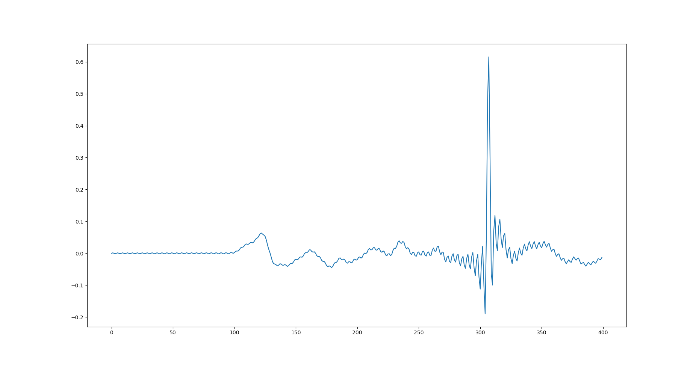
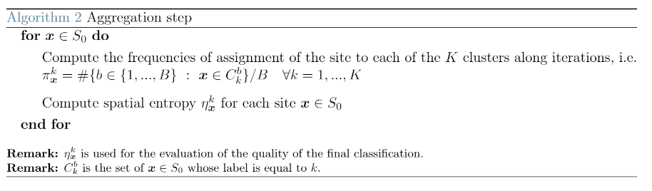

### This repository has been developed by:
* [Federica Botta](https://www.linkedin.com/in/federica-botta-8629391b3/)
* [Simone Colombara](https://www.linkedin.com/in/simone-colombara-a4a430167/)
* [Michele Di Sabato](https://www.linkedin.com/in/michele-di-sabato/)

# voronoi-functional-anomaly-detection

# Theoretical framework:

# Exploratory data analysis:

# Assumptions:
We don't know the reason behind a point being an anomaly, hence we followed two trains of thought:

1. Anomalies are grouped together (e.g. anomalies are due to measurament errors).
2. Anomaleis are isolated points (e.g. anomalies are due to  the presence of scar tissue).

Clearly, methods which are coherent with assumtpion 1 will not be well suited with assumtpion 2.

# Voronoi tessellation:
**Def:** a [Voronoi tessellation](https://en.wikipedia.org/wiki/Voronoi_diagram) is a collection of non overlapping patches which describe the geometry of the heart. We select **n** nuclei (i.e. randomly sampled points), the remaining points are assigned to the closest nucleus in a process which resembles the assigning of a point to one of the centroids in the k-means algorithm. 

**Remark on shifting:** whenever the temporal difference among signals odes not need to be taken into account, we used the algined signals (see [`alignment.py`](alignment.py)). For example:

| original signal | aligned signal
:----------:|:--------:
 | 
 | 

## Voronoi - FPCA (with aligned signals)

## Voronoi - dimesionality reduction algorithm (with original signals)

## Voronoi - dictionary learning algorithm (with original signals)

## Voronoi - weighted H1 distance (with aligned signals)
The weighted $H^1$ norm is: 
$$dist(f_1, f_2) = \|\|f_1 - f_2\|\|^2_{L^2} + \theta \|\|\partial_t f_1 - \partial_t f_2\|\|^2_{L^2}$$

