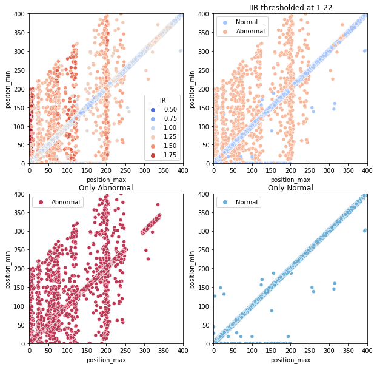
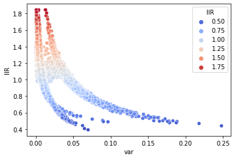

### This repository has been developed by:
* [Federica Botta](https://www.linkedin.com/in/federica-botta-8629391b3/)
* [Simone Colombara](https://www.linkedin.com/in/simone-colombara-a4a430167/)
* [Michele Di Sabato](https://www.linkedin.com/in/michele-di-sabato/)

# voronoi-functional-anomaly-detection

# Theoretical framework:
Our project takes into consideration a particular dataset composed of a very large number of spatial points
belonging to the left atrium (LA) of the heart.

  

The main activity of the heart is the mechanical contraction and expansion, these have their origin in the electrical activation of the cardiac cells. Indeed, at each heartbeat, myocytes are activated and deactivated following a characteristic electrical cycle. If a cell doesn’t work in the right way could cause some cardiac problems, such as arrhythmias.

To check the health of the heart of a patient, many studies have been conducted on the propagation of the impulse of the potential through the heart and the propagation of this signal in space and time is recorded.

  

The previous figure shows a sample of four signals from our dataset, which is composed of more than 140000 functions. It’s clear that some plots seem to be quite different from the rest. The goal of our project is to apply unsupervised clustering algorithms to classify each signal as normal or as anomalous.

Our dataset contains for each point:
* (x, y, z): spatial coordinates of the location of each point;
* (UAC1, UAC2) universal atrial components: used for the visualization of the system;
* 400 values of the electrical potential (400 time steps): value of the electrical potential in one point of the
heart as a function of time;
* IIR value: Infinite Impulse Response

# Exploratory data analysis:

In general, we can observe that[^1]:
* Anomalous signals have both their maximum amplitude and minimum amplitude small (Figure 3). The same holds for the derivative’s amplitude (Figure 4);
* Normal signals seem to have peaks very close to each other, indeed they are distributed on a linear line (Figure 5);
* Anomalies have a small variance of the signal (Figure 6);
* Normal signals tend to have a higher kurtosis and so more prominent peaks with small values around them, instead the abnormal ones tend to have lower kurtosis and so lower peaks (according to small variance) (Figure 7);
* The skewness suggests that abnormal signals always have a mean amplitude value larger than their median amplitude value, while it’s not true for normal signals (Figure 8). From these plots, we are able to identify the features most related to the anomalous signals, indeed they seem to be closer to flat signals with small amplitude peaks and small variance.

[^1]: By "normal" and "abnormal" we refer to signals having an IIR less or greater than 1.22, respectively. It is important to stress that **we do not have the labels for the signals in our dataset**, this is an unsupervised task.

These considerations were the results of the following exploratory data analysis:

| Amplitude of the absolute values of the curves | Amplitude of the absolute values of the *first derivative* of the curves
:---:|:----:
 | 

| Skewness | Kurtosis
:---:|:----:
 | 

| Displcement among argmax and argmin of the curves | Variance
:---:|:---:
 | 

**These plots reveal the importance of the IIR index, which scientific literature confirms as being an indicator for fibrosis. For this reason, throughout our project we judged the goodness of our models based on the number of signals which have an IIR fgreater than 1.22, but which are classified as anomalies. We want to keep this number as low as possible, since signals with IIR greater than 1.22 *might* be anomalies.**

Moreover, as previously explained, these plots are able to give us a representation of what an anomaly may look like.

# Assumptions:
We don't know what makes a point an anomaly, hence we followed two trains of thought:

1. Anomalies are grouped together (e.g. anomalies are due to measurament errors).
2. Anomalis are isolated points (e.g. anomalies are due to  the presence of scar tissue).

Clearly, methods which are coherent with assumtpion 1 will not be well suited with assumtpion 2. For esample, an algoithm which is methodologically similar to k-NN will of course be coherent with assumption 2: if anomalies were grouped together, then it would be impossible to classify a signal as such, just by looking at its neighbors (which will be almost surely anomalies).

# Voronoi tessellation:
We used [Voronoi tessellation](https://en.wikipedia.org/wiki/Voronoi_diagram) as a way of taking into account spatial correlation among signals.

**Def:** a Voronoi tessellation is a collection of non overlapping patches which describe the geometry of the heart. We select **n** nuclei (i.e. randomly sampled points), the remaining points are assigned to the closest nucleus in a process which resembles the assigning of a point to one of the centroids in the k-means algorithm. 

Since the choice of the **n** nuclei is random, whenever a Voronoi tessellation is involved we need to proceed in a bootstrap-like manner. 

**Remark on shifting:** whenever the temporal difference among signals odes not need to be taken into account, we used the algined signals (see [`alignment.py`](alignment.py)). For example:

| original signal | aligned signal
:----------:|:--------:
 | 
 | 

# Methods:

## :one: Voronoi - FPCA (with aligned signals)
Based on [this](https://www.sciencedirect.com/science/article/pii/S0303243412000505) paper.

  

  

## :two: Voronoi - dimesionality reduction algorithm (with original signals)
Additions with repect to :one::
1. don't work directly on signals, but on some statistics of the dataset based on our [Exploratory Data Analysis](README.md#exploratory-data-analysis);
2. less robust, hence more specific (with :one: we are saying that, for example, if the representative of 100 signals in a specific patch is clustered as anomaly, all those 100 points will be classifed as anomalies as well);
3. don't use FPCA and k-means (which might be a bottleneck);

  

## :three: Voronoi - dictionary learning algorithm (with original signals)
Based on [this](https://ieeexplore.ieee.org/document/7790862) paper. This algorithm has been designed for anomaly detection in *images*, but can be straightforwardly generalized to vectors, thanks to the fact that one step of the algorithm is to unroll some pathces of the image, thus obtaining vectors. **In our case, a vector is not obtained unrolling an image, but it componsed of the values of a signal in different time stamps: i.e. the i-th component of the vector is the evaluation of a specific signal in the i-th time stamp.** 

The dataset used to train the dictionary needs to be composed of only normal points: hence this algorithm works under the assumption of isolated anomalies. Indeed, a point is an anomaly if:
1. the coeficients which represent its "projection" onto the dictionary are not as sparse as the ones of the training set (which is composed by normal points only);
2. the dictionary representation of that point using the learned dictionary and weights is far away (in terms of L2 distance) from the true value of the point;

  

## :four: Voronoi - weighted H1 distance (with aligned signals)
The underlying idea for this algorithm was taken from graph teory, in particular regarding the centrality measure.

The weighted $H^1$ norm used in the algorithm is: 
$$dist(f_1, f_2) = \|\|f_1 - f_2\|\|^2_{L^2} + \theta \|\|\partial_t f_1 - \partial_t f_2\|\|^2_{L^2}$$

Note that now the nuclei coincide with the representatives.

  

# Conclusions :

